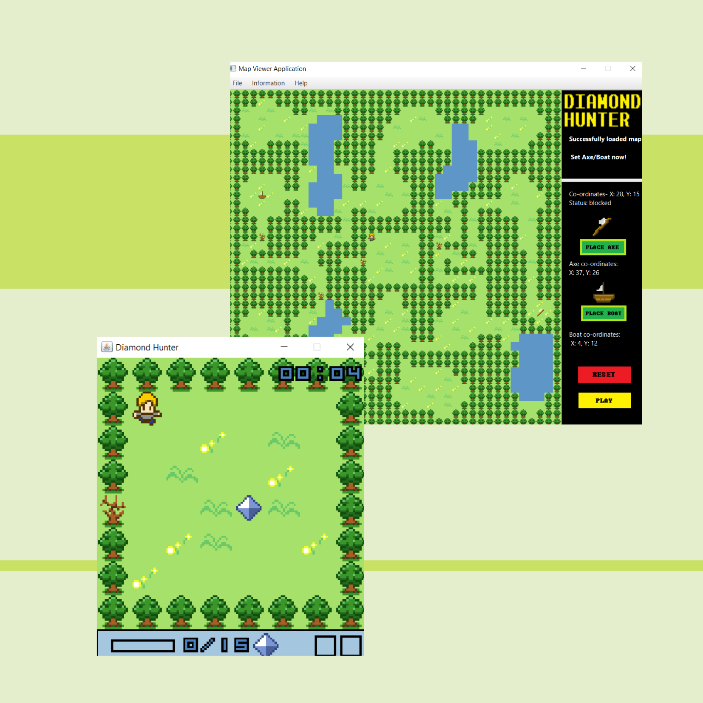

# Diamond Hunter Map Viewer
````
````

## Features 

* Map Viewer
  - whole map overview
  - reset map
  - play diamond hunter game
  
* Current Tile information Read-out
  - Blocked unblocked 
  - Currently placed item

* Item Placement
  - Axe
  - Boat

```
```

## In main game

Key: `UP, LEFT, DOWN, RIGHT` to move, `ENTER` to start the game, `SPACE` to clear the dead trees, `Esc` to pause and unpause, `F1` to return to main menu when pause. 

```
```

## To Run
 
To load MapViewer:
 * Run the .jar files 
 * WARNING: make sure you have Java FX library and JRE system library [11.0.2] downloaded before run.
 * Open command prompt
 * Type in cd 'Absolute path to where MapView.jar is'
 * Example: cd C:\Users\Default User.DESKTOP-9JB0E7L\Desktop\eclipse\CW2-Diamond-Hunter
 * Type in the line below
 * java --module-path="'absolute path to where you stored your javafx.jar files'" --add-modules=javafx.base,javafx.controls,javafx.fxml,javafx.graphics,javafx.media,javafx.swing,javafx.web -jar MapViewer.jar
 * Example: java --module-path="C:\Program Files\Java\javafx-sdk-11.0.2\lib" --add-modules=javafx.base,javafx.controls,javafx.fxml,javafx.graphics,javafx.media,javafx.swing,javafx.web -jar MapViewer.jar
 
 To Run the game only
 * Double click to run normally
 * Right-click to run wit Java (TM) SE binary in case it doesn't work
 
 
 To Set Axe/Boat:
 * Click Place Axe/Boat on the right side of the MapViwer.
 * Then just click the position you want to put axe/boat.
 * You can change the position as many as you can, but we will only keep the final position for the game.
 * You can reset Axe/Boat using the reset button. 
 
 Close Map Viewer:
 * MenuBar—File—Close
 
````
````

## Developer Information
- Aimi Syahirah Sazali 
- Hani Izzati Md Azmi
- Hanis Athirah Binti Abdullah  
- William Alexendar Ong Jia Jiang

